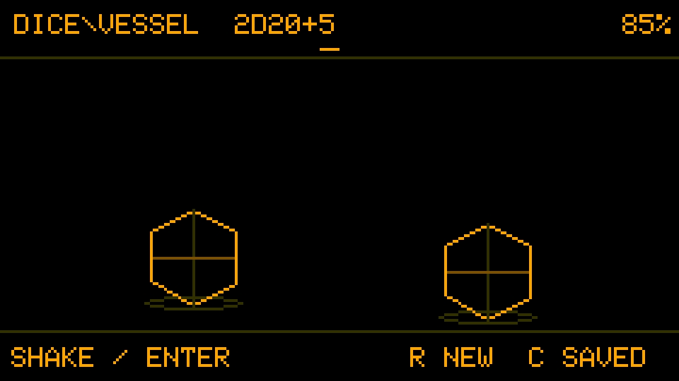
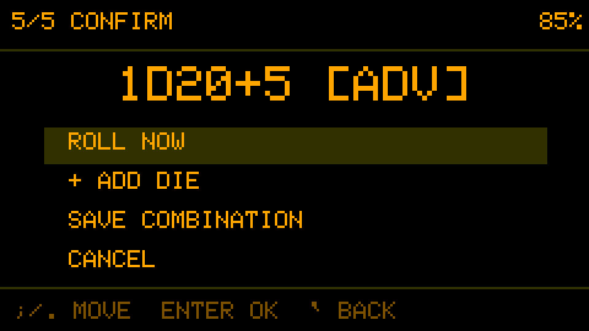
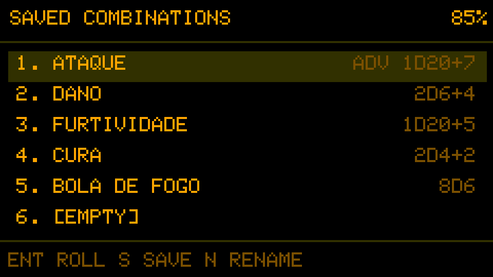
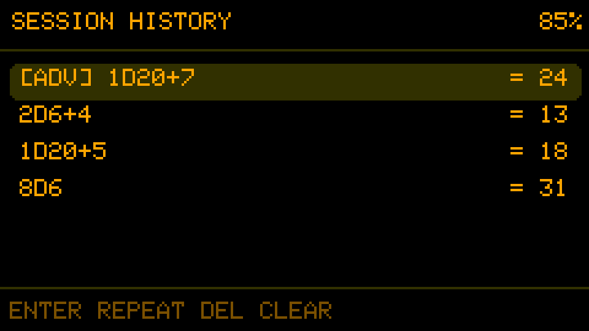

# DICE\\VESSEL

**KEEP ROLLING.**

[Português (Brasil)](README.pt-BR.md)


A pocket campaign companion for fast, flexible dice rolls on the M5Stack Cardputer.

DICE\\VESSEL helps keep the game moving. Build mixed dice expressions through a guided workflow, save recurring combinations, review recent rolls, and roll with a key or—on supported hardware—a shake. Fluid animation and responsive sound add character without slowing down the session.


## Highlights

- Guided builder and direct expressions for simple, mixed, bonus, and penalty rolls.
- D2, D4, D6, D8, D10, D12, D20, and a two-die percentile D100.
- Normal, Advantage, and Disadvantage modes for single-D20 checks.
- Click-to-roll everywhere, plus shake-to-roll when an IMU is available.
- Hardware RNG separated from gesture strength, animation, and sound.
- Cinematic dice motion with circular collisions, wall impacts, wooden-box audio, and focused D20 feedback.
- Eight named combinations and a persistent ten-roll history with exact rerolling.
- English and Brazilian Portuguese, eight accent colors, tabbed settings, instructions, and animated charging mode.

## Interface

| Roller | Guided builder |
|---|---|
|  |  |
| Saved combinations | Roll history |
|  |  |

## Accent colors

The original black-and-Amber identity remains the default. Seven optional accents recolor the interface without changing its layout or visual character.


## Quick controls

| Key | Action |
|---|---|
| `Enter` | Roll the current expression |
| `R` | Open the guided roll builder |
| `C` | Open saved combinations |
| `H` | Open session history |
| `M` | Open the menu or return to the previous screen |
| Alphanumeric keys | Type an expression directly |
| `Backspace` | Delete the last character |
| `Tab` | Select the next guided field |
| `[` / `]` | Decrease or increase the selected field |
| `Esc` / `` ` `` | Alternative back controls |

On the Cardputer keyboard, `Fn+L` / `Fn+M` move up/down and `Fn+N` / `Fn+,` move left/right. Standard HID arrows and Escape are accepted when available.

Change language under **Options → System → Language**.

## Install

The easiest test installation uses the complete image from the GitHub release:

1. Download the latest `dicevessel-*-factory.bin` release image.
2. Connect the Cardputer by USB.
3. Flash the file at offset `0x0` with an ESP32-S3 compatible tool.
4. Restart the device.

Detailed instructions and component offsets are in [Flashing Guide](docs/FLASHING.md).

## Build from source

Install [PlatformIO](https://platformio.org/) and run:

```bash
pio run -e m5stack-cardputer
pio run -e m5stack-cardputer -t upload
```

The target is M5Stack StampS3 / Cardputer with the Arduino framework. Build dependencies are declared in `platformio.ini`.

## Project structure

```text
include/           Data models and module interfaces
src/               UI, parser, physics, audio, storage, and application flow
docs/screenshots/  Pixel-accurate interface captures used by the README
release/           Ready-to-upload release binaries
```

## Release status

DICE\\VESSEL 1.0 is the first stable release. Its deliberately focused scope leaves these extensions for later versions:

- the final hand-drawn sprite atlas remains planned;
- dedicated Cardputer ADV motion calibration profiles;
- exploding dice and success pools are not implemented yet.

See [CHANGELOG.md](CHANGELOG.md) and [ROADMAP.md](docs/ROADMAP.md).

## License

DICE\\VESSEL is released under the [MIT License](LICENSE).

## Credits

- Concept: Andre Fuentes — [@anfuentz](https://github.com/anfuentz)
- Vibecoded by Codex

> “We are the music makers, and we are the dreamers of dreams.”
