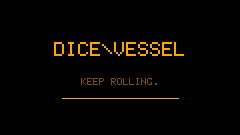
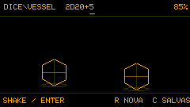
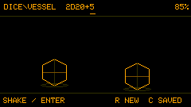
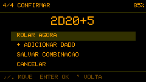
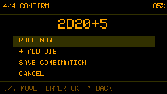
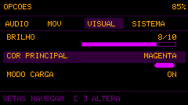
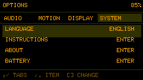

# DICE\\VESSEL

**KEEP ROLLING.**

[English](README.md)

Um companheiro de campanha de bolso para rolagens rápidas e flexíveis no M5Stack Cardputer.

O DICE\\VESSEL ajuda a manter a partida em movimento. Monte expressões com diferentes dados por um assistente guiado, salve combinações recorrentes, consulte as rolagens recentes e role com uma tecla ou—em aparelhos compatíveis—sacudindo o Cardputer. Animações fluidas e sons responsivos dão personalidade sem atrasar a sessão.



## Destaques

- Assistente guiado: tipo de dado, quantidade, bônus ou penalidade final e confirmação.
- Expressões diretas como `2D20+1`, `3D6-2` e `1D20+1D8+5`.
- D2, D4, D6, D8, D10, D12, D20 e D100.
- Click-to-roll em qualquer Cardputer.
- Shake-to-roll quando houver uma IMU disponível.
- RNG de hardware consultado somente no release; a força do gesto nunca altera a probabilidade.
- Movimento 2D cinematográfico, colisões circulares, impactos nas paredes e representação de caixa cheia.
- Áudio procedural de caixa de madeira, som exclusivo de moeda e efeitos de crítico/falha.
- Oito espaços persistentes para combinações salvas.
- Histórico das dez últimas rolagens da sessão.
- Interface em inglês e português brasileiro.
- Opções em abas, controles de 0 a 10, instruções, tela Sobre e modo de carga animado.

## Interface

| Português | English |
|---|---|
|  |  |
|  |  |
|  |  |

## Controles rápidos

| Tecla | Ação |
|---|---|
| `Enter` | Rolar a expressão atual |
| `R` | Abrir o assistente de nova rolagem |
| `C` | Abrir combinações salvas |
| `H` | Abrir histórico da sessão |
| Teclas alfanuméricas | Digitar uma expressão diretamente |
| `Backspace` | Apagar o último caractere |
| `Tab` | Selecionar o próximo campo guiado |
| `[` / `]` | Diminuir ou aumentar o campo selecionado |
| `` ` `` | Abrir opções ou voltar |

No teclado do Cardputer, `Fn+L` / `Fn+M` movimentam para cima/baixo e `Fn+N` / `Fn+,` para esquerda/direita. Setas HID e Escape também funcionam quando disponíveis.

Altere o idioma em **Opções → Sistema → Idioma**.

## Instalação

A forma mais simples de testar usa a imagem completa publicada na release do GitHub:

1. Baixe `dicevessel-v0.4-beta-factory.bin`.
2. Conecte o Cardputer por USB.
3. Grave o arquivo no offset `0x0` com uma ferramenta compatível com ESP32-S3.
4. Reinicie o aparelho.

As instruções detalhadas e os offsets de cada componente estão no [Guia de gravação](docs/FLASHING.md#português-brasil).

## Compilar o projeto

Instale o [PlatformIO](https://platformio.org/) e execute:

```bash
pio run -e m5stack-cardputer
pio run -e m5stack-cardputer -t upload
```

O alvo é o M5Stack StampS3 / Cardputer usando Arduino. As dependências estão declaradas em `platformio.ini`.

## Estado atual

Esta é uma versão beta voltada a testes em hardware. Limitações atuais:

- o histórico não persiste depois de desligar;
- combinações salvas usam espaços numerados, ainda sem nomes personalizados;
- o D100 ainda usa uma apresentação percentual compacta;
- o atlas final de sprites desenhados à mão ainda será produzido;
- a calibração de movimento do Cardputer ADV precisa de mais testes dedicados;
- vantagem/desvantagem, dados explosivos e pools de sucesso ainda não foram implementados.

Consulte [CHANGELOG.md](CHANGELOG.md) e [ROADMAP.md](docs/ROADMAP.md).

## Licença

O DICE\\VESSEL é distribuído sob a [Licença MIT](LICENSE).

## Créditos

- Conceito: Andre Fuentes — [@anfuentz](https://github.com/anfuentz)
- Vibecoded by Codex

> “We are the music makers, and we are the dreamers of dreams.”
