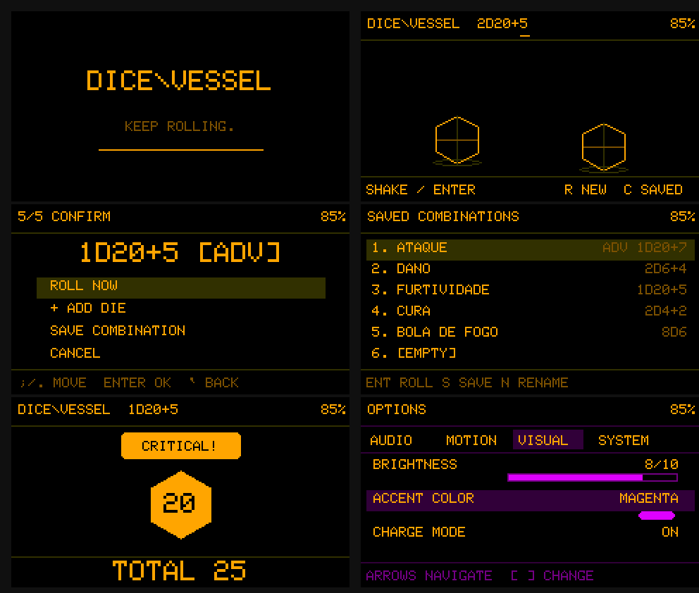
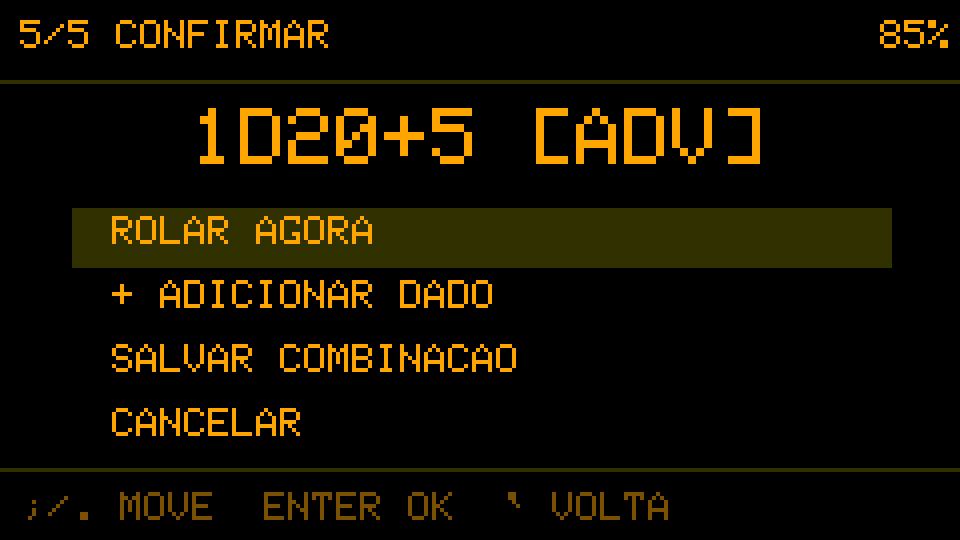
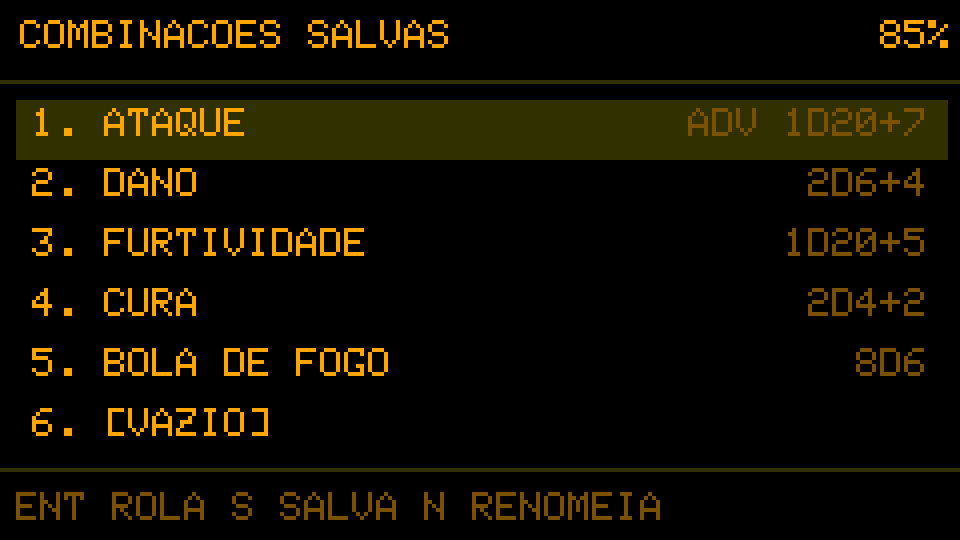
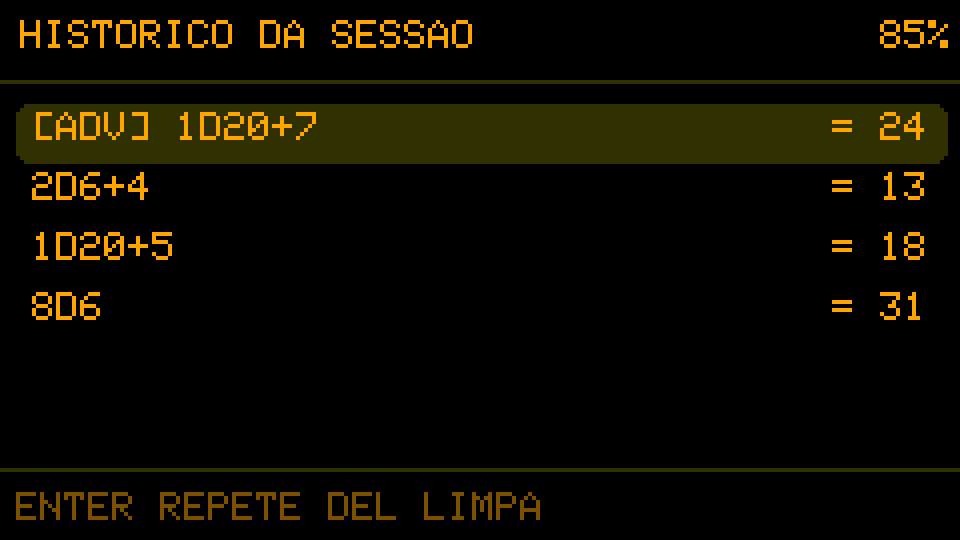
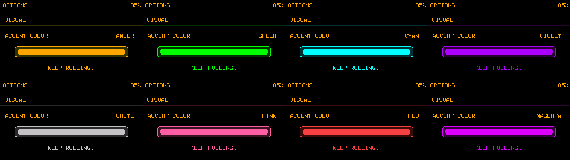

# DICE\\VESSEL

**KEEP ROLLING.**

[English](README.md)

Um companheiro de campanha de bolso para rolagens rápidas e flexíveis no M5Stack Cardputer.

O DICE\\VESSEL ajuda a manter a partida em movimento. Monte expressões com diferentes dados por um assistente guiado, salve combinações recorrentes, consulte as rolagens recentes e role com uma tecla ou—em aparelhos compatíveis—sacudindo o Cardputer. Animações fluidas e sons responsivos dão personalidade sem atrasar a sessão.



## Destaques

- Assistente guiado e expressões diretas para rolagens simples, mistas, bônus e penalidades.
- D2, D4, D6, D8, D10, D12, D20 e D100 percentual representado por dois dados.
- Modos Normal, Vantagem e Desvantagem para testes com um único D20.
- Click-to-roll em qualquer Cardputer e shake-to-roll quando houver uma IMU.
- RNG de hardware separado da força do gesto, das animações e dos sons.
- Movimento cinematográfico com colisões, impactos nas paredes, áudio de caixa de madeira e feedback específico para D20.
- Oito combinações nomeadas e histórico persistente das dez últimas rolagens, com repetição exata.
- Português brasileiro e inglês, oito cores, opções em abas, instruções e modo de carga animado.

## Interface

| Rolador | Assistente guiado |
|---|---|
|  |  |
| Combinações salvas | Histórico de rolagens |
|  |  |

## Cores principais

A identidade original em preto e âmbar continua sendo o padrão. Outras sete cores podem ser escolhidas sem alterar a organização ou a personalidade visual do firmware.



## Controles rápidos

| Tecla | Ação |
|---|---|
| `Enter` | Rolar a expressão atual |
| `R` | Abrir o assistente de nova rolagem |
| `C` | Abrir combinações salvas |
| `H` | Abrir histórico da sessão |
| `M` | Abrir o menu ou voltar à tela anterior |
| Teclas alfanuméricas | Digitar uma expressão diretamente |
| `Backspace` | Apagar o último caractere |
| `Tab` | Selecionar o próximo campo guiado |
| `[` / `]` | Diminuir ou aumentar o campo selecionado |
| `Esc` / `` ` `` | Controles alternativos para voltar |

No teclado do Cardputer, `Fn+L` / `Fn+M` movimentam para cima/baixo e `Fn+N` / `Fn+,` para esquerda/direita. Setas HID e Escape também funcionam quando disponíveis.

Altere o idioma em **Opções → Sistema → Idioma**.

## Instalação

A forma mais simples de testar usa a imagem completa publicada na release do GitHub:

1. Baixe a imagem mais recente `dicevessel-*-factory.bin` publicada nas releases.
2. Conecte o Cardputer por USB.
3. Grave o arquivo no offset `0x0` com uma ferramenta compatível com ESP32-S3.
4. Reinicie o aparelho.

As instruções detalhadas e os offsets de cada componente estão no [Guia de gravação](docs/FLASHING.md#português-brasil).

## Compilar o projeto

Instale o [PlatformIO](https://platformio.org/) e execute:

```bash
pio run -e m5stack-cardputer
pio run -e m5stack-cardputer -t upload
```

O alvo é o M5Stack StampS3 / Cardputer usando Arduino. As dependências estão declaradas em `platformio.ini`.

## Estado da versão

O DICE\\VESSEL 1.0 é a primeira versão estável. Seu escopo foi mantido intencionalmente conciso, deixando estas expansões para versões futuras:

- o atlas final de sprites desenhados à mão ainda será produzido;
- perfis dedicados de calibração de movimento para o Cardputer ADV;
- dados explosivos e pools de sucesso ainda não foram implementados.

Consulte [CHANGELOG.md](CHANGELOG.md) e [ROADMAP.md](docs/ROADMAP.md).

## Licença

O DICE\\VESSEL é distribuído sob a [Licença MIT](LICENSE).

## Créditos

- Conceito: Andre Fuentes — [@anfuentz](https://github.com/anfuentz)
- Vibecoded by Codex

> “We are the music makers, and we are the dreamers of dreams.”
